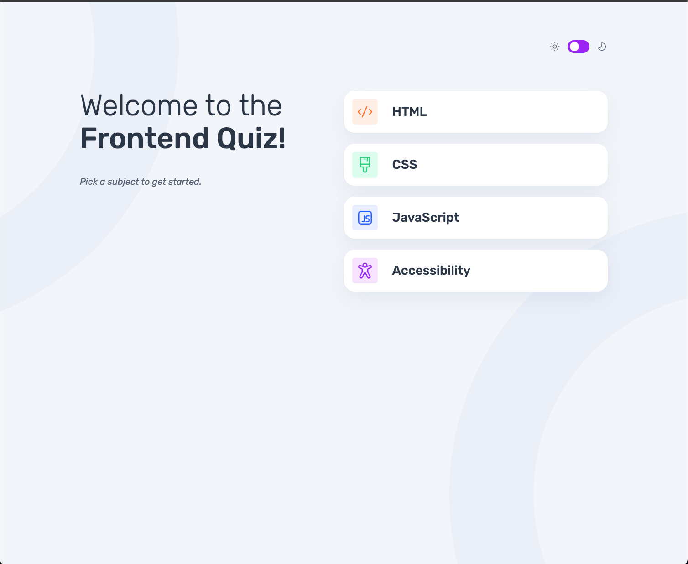
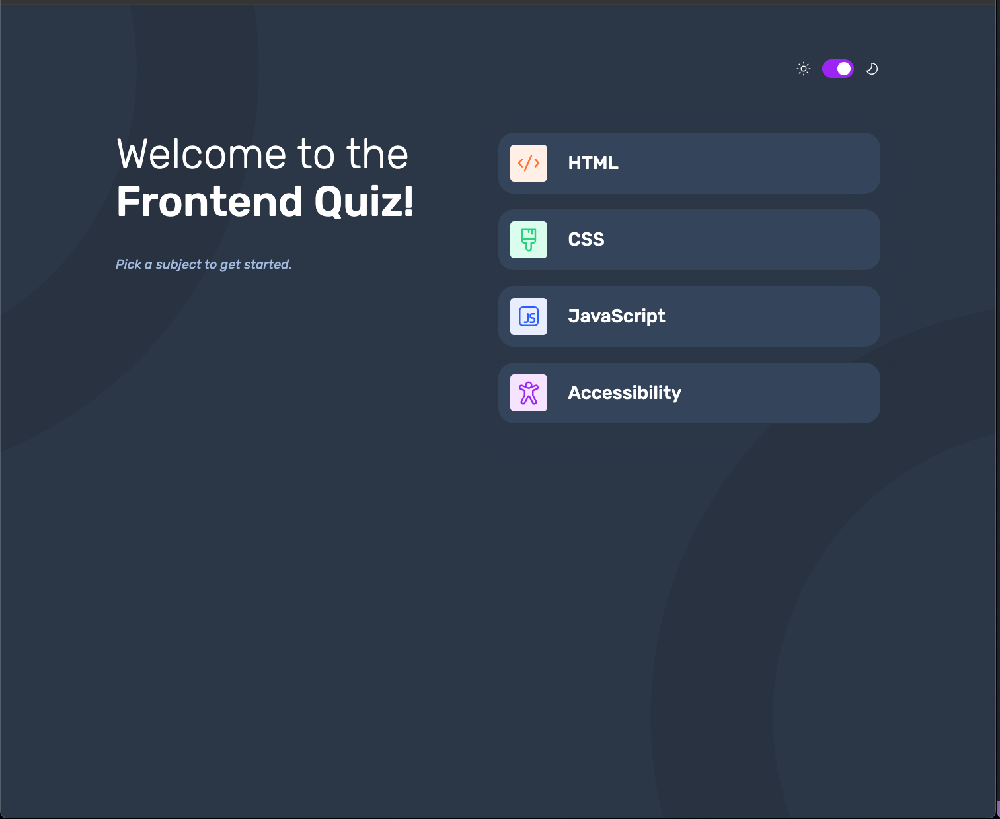
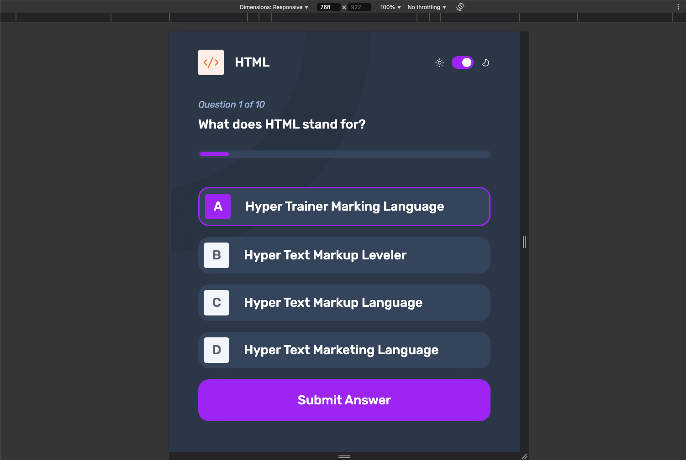
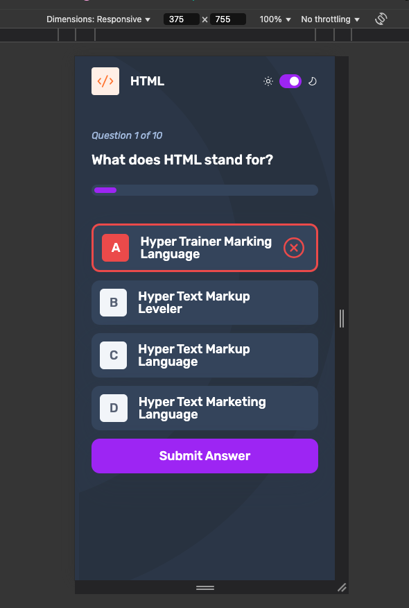

# Frontend Mentor - Frontend quiz app solution

This is a solution to the [Frontend quiz app challenge on Frontend Mentor](https://www.frontendmentor.io/challenges/frontend-quiz-app-BE7xkzXQnU). Frontend Mentor challenges help you improve your coding skills by building realistic projects.

## Table of contents

- [Overview](#overview)
  - [The challenge](#the-challenge)
  - [Screenshot](#screenshot)
  - [Links](#links)
- [My process](#my-process)
  - [Built with](#built-with)
  - [What I learned](#what-i-learned)
  - [Continued development](#continued-development)
  - [Useful resources](#useful-resources)
- [Author](#author)

## Overview

### The challenge

Users should be able to:

- Select a quiz subject
- Select a single answer from each question from a choice of four
- See an error message when trying to submit an answer without making a selection
- See if they have made a correct or incorrect choice when they submit an answer
- Move on to the next question after seeing the question result
- See a completed state with the score after the final question
- Play again to choose another subject
- View the optimal layout for the interface depending on their device's screen size
- See hover and focus states for all interactive elements on the page
- Navigate the entire app only using their keyboard
- **Bonus**: Change the app's theme between light and dark

### Screenshot






### Links

- Solution URL: [Repo URL](https://github.com/hectorlil48/hectors-frontend-quiz-app)
- Live Site URL: [Live Site URl](https://hectorlil48.github.io/hectors-frontend-quiz-app/)

## My process

### Built with

- Semantic HTML5 markup
- CSS custom properties
- Flexbox
- Mobile-first workflow
- [React](https://reactjs.org/) - JS library

### What I learned

Building this quiz app was an incredible learning experience. While I initially watched a tutorial to understand the basics of React, I ended up learning so much more as I got deeper into the project.

- Passing Props: I learned how to pass data between components using props, which allowed me to make my app dynamic and reusable.

- Setting Up My Folder Structure: Organizing the project folder was a key skill. It helped me maintain clarity and efficiency, especially as my app grew.

- Conditional Logic: Writing conditionals was essential for handling different states, such as toggling the button between “Submit” and “Next Question.” This taught me how to manage user flow effectively.

- Implementing Dark/Light Mode: I learned how to switch between dark and light modes, providing a more customizable user experience.

- Component Interaction: I gained a deeper understanding of how different React components can communicate and work together, making the app modular and scalable.

- Using useEffect: I used the useEffect hook to fetch data from my JSON file, which gave me hands-on experience with React hooks and data management.

- Handling onClick Events: Learning how to handle onClick events allowed me to make the app interactive, especially for navigation between questions.

- Deploying on GitHub Pages: Finally, I learned how to deploy my app to GitHub Pages, making it accessible to anyone and giving me real-world experience in app deployment.

```html
<div className="App" data-theme={isDark ? "dark" : "light"} role="main"></div>
```

```css
[data-theme="dark"] {
  --background-color: #313e51;
  --primary-text-color: #fff;
  --pick-msg-color: #abc1e1;
  --btn-bg-color: #3b4d66;
  --error-message: #fff;
  --box-shadow-color: rgba(49, 62, 81, 0.14);
}

[data-theme="dark"].App {
  background-image: url("../assets/images/pattern-background-mobile-dark.svg");
}
```

```js
useEffect(() => {
  fetch("/hectors-frontend-quiz-app/data.json")
    .then((response) => response.json())
    .then((data) => {
      setQuizzes(data.quizzes);
    })
    .catch((error) => console.error("Error fetching data:", error));
}, []);

const handleQuizSelection = (quiz) => {
  setQuizTitle(quiz.title); // Store quiz title in local storage
  setQuizIcon(quiz.icon);
  setQuizData({ ...quiz, index: 0, completed: false }); // Store quiz data
};
```

### Continued development

Building the quiz app marked just the beginning of my journey in web development. As I reflect on the progress I've made, I'm excited about the areas where I can continue to grow.

- Mastering React: While I’ve grasped the basics of React, I know there’s still much to explore. I’m eager to dive deeper into advanced concepts like Context API, React Router, and state management with Redux to build more complex applications.

- Improving Problem-Solving Skills: Each challenge I faced in this project—whether it was debugging, optimizing performance, or handling edge cases—helped me refine my problem-solving abilities. I plan to continue strengthening this skill by tackling more complex projects and learning from each step.

- Exploring Testing: I want to explore writing tests for my applications to ensure they are robust and maintainable. Understanding tools like Jest and React Testing Library will be a priority in my next steps.

- Focusing on UI/UX: While I’ve made the quiz app functional, I see room for improvement in terms of design and user experience. I plan to study more about UI/UX principles to make my apps more user-friendly and visually appealing.

- Back-End Development: While I’ve worked with front-end technologies, I want to expand my knowledge to full-stack development. I plan to work with Node.js, Express, and databases like MongoDB to build complete web applications.

- Deployment and CI/CD: I’m also interested in learning more about deployment practices, Continuous Integration (CI), and Continuous Deployment (CD) to automate my workflow and ensure smooth project releases.

### Useful resources

- [ChatGPT](https://chatgpt.com/) - This tool was invaluable for brainstorming ideas, refining technical descriptions, and troubleshooting code efficiently. I appreciated how it provided clear examples and explanations tailored to my projects.
- [React.dev](https://react.dev/) - The official React documentation was my go-to for understanding core concepts like state management, hooks, and component lifecycle. It helped me structure my app efficiently and follow best practices.
- [MDN Web Docs](https://developer.mozilla.org/en-US/) - I relied on MDN for JavaScript references, especially when working with event listeners, array methods, and handling user inputs in my quiz logic.

## Author

- GitHub - [Hector Ramirez](https://github.com/hectorlil48)
- Frontend Mentor - [@hectorlil48](https://www.frontendmentor.io/profile/hectorlil48)
- LinkedIn - [@linkedin.com/in/hector-ramirez-6a6509170](https://www.linkedin.com/in/hector-ramirez-6a6509170/)
